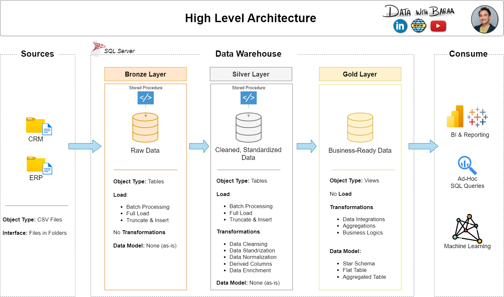

## DWP Epics
- Requirements analysis (done)
- Design Data Architecture (done)

- Project initialization

## DWP tasks

### 1. Requirments analysis

- analyse & understand the requirements 

### 2. Design Data Architecture

- choose data management approach
- Design the layers
- Draw the data architecture (Draw.io)

### 3. Project initialization

- 

