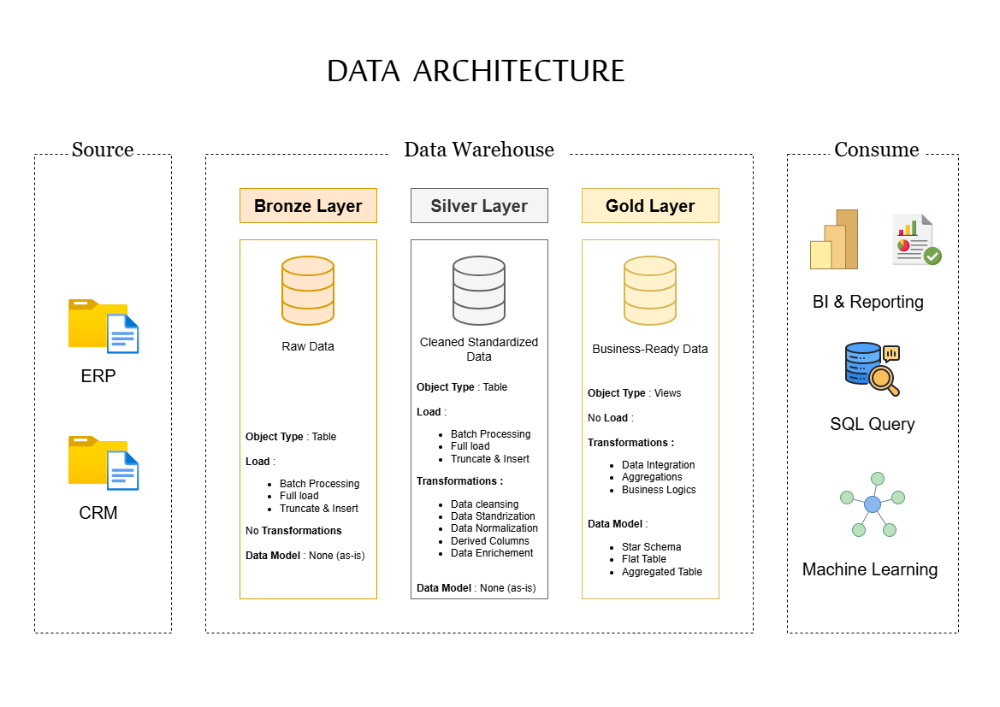
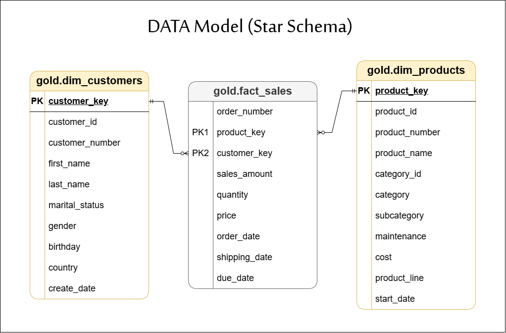

# Project Requirements

## Building the data warehouse

Develop a modern data warehouse using SQL to consolidate sales data, enabling analytical reporting and informed decision making.

**Specifications**

- Data Sources : import data (ERP and CRM) as CSV files.
- Data Quality : Clean and resolve data quality issues prior to analysis.
- Integration : Combine both sources into single.
- Scope : Focus on the latest dataset only; historization is not required;
- Documentation : Provide clear documentation of the data model.

# Data Warehouse Project

A modern data warehouse built with **PostgreSQL** following the **Medallion Architecture** (Bronze → Silver → Gold).

---

## Overview

This project demonstrates a complete ETL pipeline that:

1. **Bronze** — Loads raw CSV data from CRM and ERP sources
2. **Silver** — Cleans, deduplicates, and standardizes the data
3. **Gold** — Builds a star schema (dimensions + fact table) for analytics

---

## Architecture



---

## Data Model



---

## 📁 Project Structure

```
data-warehouse-project/
│
├── datasets/                           # Raw datasets used for the project (ERP and CRM data)
│
├── docs/                               # Project documentation and architecture details
│   ├── data_architecture.drawio        # Draw.io file shows the project's architecture
│   ├── data_catalog.md                 # Catalog of datasets, including field descriptions and metadata
│   ├── data_flow.drawio                # Draw.io file for the data flow diagram
│   ├── data_model.drawio              # Draw.io file for data models (star schema)
│   ├── naming_conventions.md           # Consistent naming guidelines for tables, columns, and files
│
├── scripts/                            # SQL scripts for ETL and transformations
│   ├── bronze/                         # Scripts for extracting and loading raw data
│   ├── silver/                         # Scripts for cleaning and transforming data
│   ├── gold/                           # Scripts for creating analytical models
│
├── tests/                              # Test scripts and quality files
│
|── README.md                           # Project overview and instructions
```

---

## Getting Started

### Prerequisites

- PostgreSQL 14+
- `psql` command-line tool

### 1. Clone the repository

```bash
git clone https://github.com/imad-0/data-warehouse-project.git
cd data-warehouse-project
```

### 2. Create the database

```bash
psql -U postgres -c "CREATE DATABASE datawarehouse;"
```

### 3. Run the scripts (from the project root)

---

## 👤 Author

**Your Name**

- GitHub: [@your-username](https://github.com/IMAD-0)
